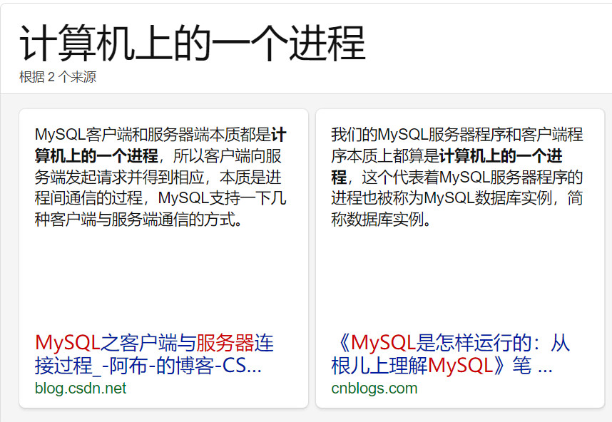
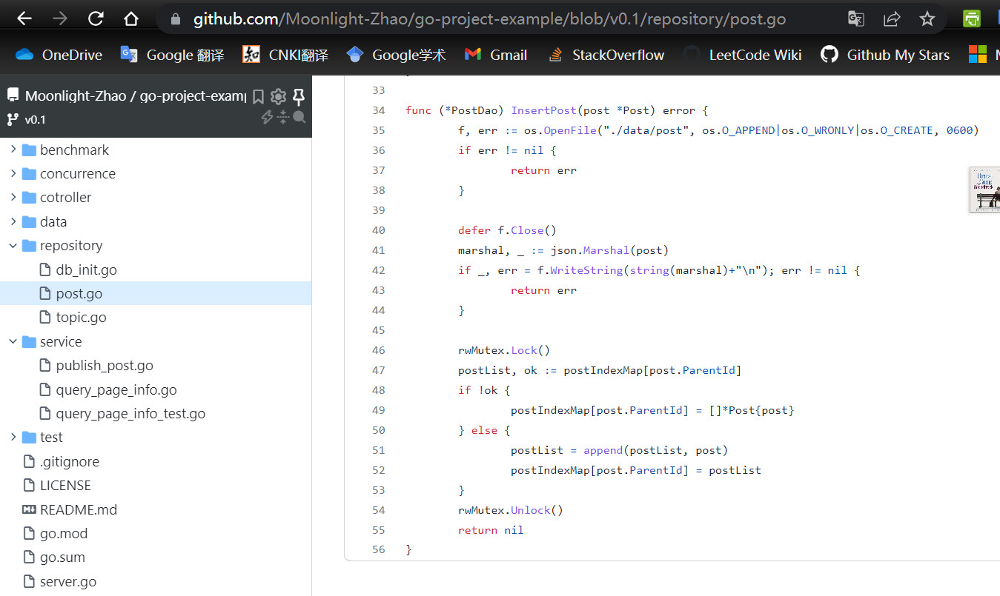
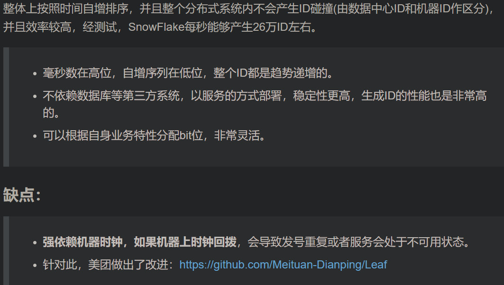

# 1. example.sql 简介
创建了community数据库
创建了user表

## 1.1. go mod download的包位置
C:\Users\D\go\pkg\mod

## 1.2. mysql dsn
dsn is short for 'data source name'
[username[:password]@][protocol][address]]/dbname[?param1=value1&...&paramN=valueN]

## 1.3. why is here 'tcp'?
https://blog.csdn.net/qinglingls/article/details/96864122
mysql有四种连接方式：
端口
tcp
socket
pipe

## 1.4. mysql本质：一个进程，提供server，其他进程作为client与其通信，所以需要有连接这一步的操作
[掘金 mysql本质和功能](https://juejin.cn/post/6931240254040981511)


# 2. repository三个文件topic,post,user
是对这三张表的增删改查的封装，本质是一个dao（Data Access Object，数据访问接口。数据访问：故名思义就是与数据库打交道。夹在业务逻辑与数据库资源中间）

## sync.once
```
var postDao *PostDao
var postOnce sync.Once
```
sync.Once 是 Go 标准库提供的使函数只执行一次的实现，常应用于**单例模式**，例如初始化配置、保持数据库连接等。作用与 init 函数类似，但有区别。

init 函数是当所在的 package 首次被加载时执行，若迟迟未被使用，则既浪费了内存，又延长了程序加载时间。
sync.Once 可以在代码的任意位置初始化和调用，**因此可以延迟到使用时再执行，并发场景下是线程安全的**。
在多数情况下，sync.Once 被用于控制变量的初始化，这个变量的读写满足如下三个条件：

当且仅当第一次访问某个变量时，进行初始化（写）；
变量初始化过程中，所有读都被阻塞，直到初始化完成；
变量仅初始化一次，初始化完成后驻留在内存里。
sync.Once 仅提供了一个方法 Do，参数 f 是对象初始化函数
```
func (o *Once) Do(f func())
```

## 关于nil
1. Go的文档中说到，nil是预定义的标识符，代表指针、通道、函数、接口、映射或切片的零值,并不是GO 的关键字之一
2. nil只能赋值给指针、channel、func、interface、map或slice类型的变量 (非基础类型) 否则会引发 panic

## 疑问：为什么postDao strcut没有被定义出来

## ORM
object-relationship model
sql数据库的dao操作封装
https://blog.csdn.net/u010947534/article/details/90669452

## 调用其他包内函数或对象：import
```
package service

import (
	"github.com/Moonlight-Zhao/go-project-example/repository"
	"github.com/Moonlight-Zhao/go-project-example/util"
	"os"
	"testing"
)
```
## go语言基础
编译器会主动把特定符号后的换行符转换为分号

# gin web framework
## gin.H
```
// H is a shortcut for map[string]interface{}
type H map[string]interface{}
```

# golang中的interface{}语言接口
interface{}是go中的空接口，任意类型都实现了空接口，因此当我们直接用interface{}作为类型声明一个实例，则这个实例可以承载任意类型的值

所以在type PageData struct中可以使用``` Data interface{}```传递数据 

# golang import本地其他位置的文件夹或者包
可以用$gopath/src相对路径，可以用本文件对应的相对位置

# golang类和结构体
golang没有类的关键字，struct其实就声明了一个类
[golang中的类和类声明函数](https://blog.csdn.net/qq756684177/article/details/81518823)

# 20220510开发记录
## 提问
我本来是希望publish post操作完成后，返回给用户的数据Data，是包含了 topic title,post content,timestamp create_time，但是这里就涉及到了insert和交叉查询
第一步，把对应的post内容组织好后，insert到post文件中
第二步，按照post提供的parent_id查询到topic文件中的topic title
这样，不知道应该在哪一层做交叉功能，感觉层与层之间的职责区分不明确，这个是一个值得思考的点，即在MVC分层开发中，同层之间的交叉调用应该如何更好地设计

## 并发安全的insert post


## 生成随机id和创建时间戳是在service层做的，repository只需要负责并发安全地把数据写入 文件map/数据库中

# golang单例模式,sync.once

# snowflakes算法
[算法思想 & go实现](https://zhuanlan.zhihu.com/p/373485947)
